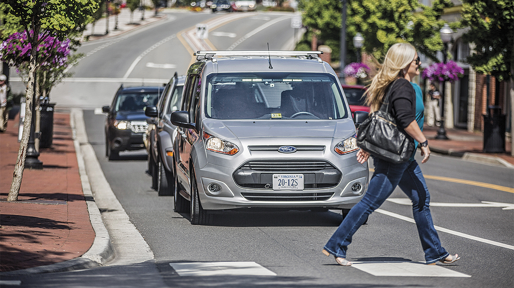
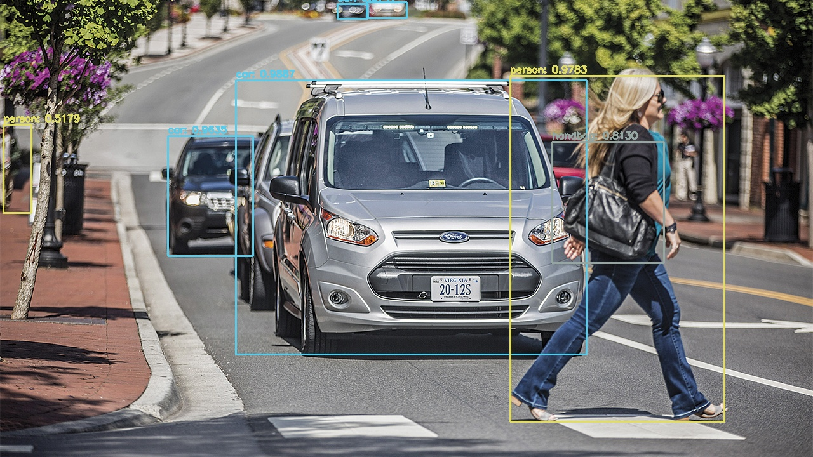

# Object_Detection
# YOLO Object Detection with OpenCV

This project demonstrates how to perform real-time object detection using the YOLO (You Only Look Once) algorithm implemented via OpenCV. YOLO is a state-of-the-art, fast, and accurate object detection system that identifies multiple objects in a single pass over the image.

---

## Features

- **Real-Time Detection:** Detects objects in images with high accuracy.
- **Pre-Trained Model:** Uses the COCO dataset (Common Objects in Context) with 80 classes for object detection.
- **Customizable Thresholds:** Allows users to configure confidence and suppression thresholds for better detection.
- **Output Visualization:** Saves detected images with bounding boxes and class labels.

---

## Requirements

### Libraries

- **OpenCV:** For image processing and object detection.
- **NumPy:** For numerical computations.
- **Python 3.7+**: The script is written in Python and uses the latest features of OpenCV and NumPy.

### Dataset

- **YOLOv3 Weights and Configuration:**
  - `yolov3.weights` - Pre-trained weights file.
  - `yolov3.cfg` - Configuration file for the YOLOv3 model.
  - `coco.names` - Contains the names of the 80 object classes supported by the COCO dataset.

---

## Installation

1. Clone the repository:
    ```bash
    git clone https://github.com/your-repo-name/yolo-object-detection.git
    cd yolo-object-detection
    ```

2. Install dependencies:
    ```bash
    pip install opencv-python numpy
    ```

3. Download the required YOLO files:
    - Download `yolov3.weights` and `yolov3.cfg` from the official YOLO repository.
    - Place them in the `yolo-coco` directory.

4. Ensure the `coco.names` file is present in the `yolo-coco` directory.

---

## Usage

### Running the Script

1. Place the input image in the `images` folder.
2. Run the script:
    ```bash
    python yolo.py --image images/<your-image-name>.jpg
    ```
3. The output image will be saved to the specified output folder with the detected objects annotated.

### Example

```bash
python yolo.py --image images/baggage_claim.jpg

## Example Outputs

### Input Image:


### Output Image:


